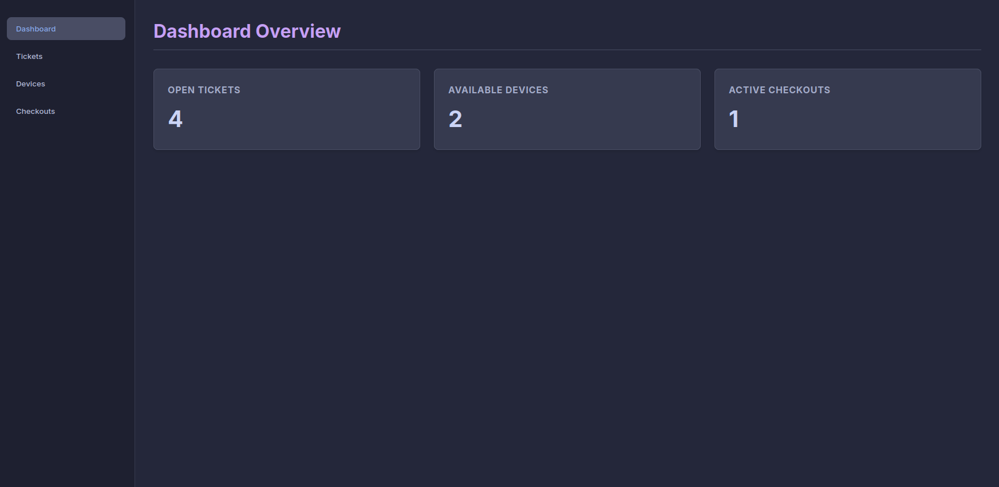
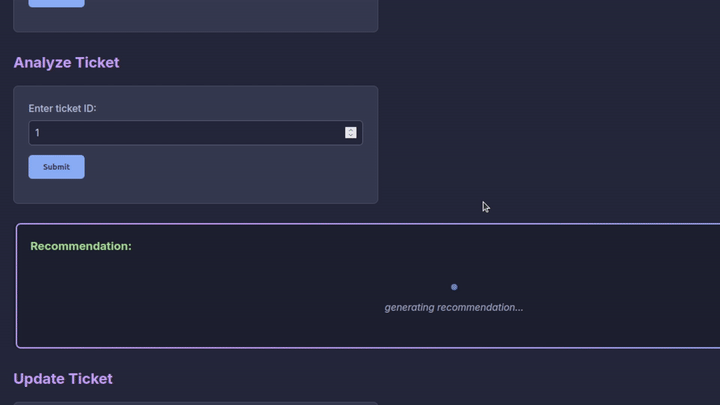

# HelpdeskPilot AI

An AI-powered IT support assistant. HelpdeskPilot AI helps technicians handle support tickets by automatically classifying issues and suggesting solutions using RAG.

[](https://fastapi.tiangolo.com/)
[](https://reactjs.org/)
[](https://www.sqlite.org/)
[](https://www.docker.com/)

---

## Live Demo & Documentation

*   **Frontend**: [helpdesk-pilot-ai.vercel.app](https://helpdesk-pilot-ai.vercel.app/)
*   **API Documentation**: [hdpilot-backend.onrender.com/docs](https://hdpilot-backend.onrender.com/docs)

> **Note**: The backend is hosted on a free tier. If the requests from the frontend don't load immediately, please give it 30 to 60 seconds to wake up!

---

## Showcase

### Dashboard


### Smart Analysis


---

## Key Features

*   **AI Ticket Classification**: Every incoming ticket is automatically categorized and prioritized.
*   **Smart Recommendations**: One click analyzes a ticket and suggests a solution using the Gemini API.
*   **RAG (Retrieval-Augmented Generation)**: The LLM searches your internal docs to find the right answer.
*   **Equipment Tracking**: Manage hardware inventory and track who has what checked out.
*   **Local-First Development**: Works with Ollama so you can test AI features without an API key.

---

## Architecture

*   **Frontend**: A responsive React app built with Vite.
*   **Backend**: A FastAPI server that handles logic and data.
*   **Data Store**: SQLite for tickets and inventory, plus ChromaDB for searching documentation.
*   **AI Engine**: Uses Google Gemini 1.5 Flash (or Ollama locally) to generate summaries and fixes.

### The Data Flow
1.  **Ingestion**: Internal guides are chunked and stored in a vector database.
2.  **Match**: When you analyze a ticket, the system finds the most relevant guide snippets.
3.  **Synthesis**: The ticket + snippets are sent to the LLM.
4.  **Result**: You get a precise recommendation based on actual company docs.

---

## Tech Stack

*   **Core**: Python, FastAPI, React
*   **AI**: Gemini API, ChromaDB, Ollama
*   **Database**: SQLAlchemy, SQLite
*   **Testing**: Pytest
*   **DevOps**: Docker, Nginx, Render, Vercel

---

## Getting Started

### 1. Prerequisites
*   Python 3.10+ and Node.js
*   (Optional) Gemini API Key in a `.env` file
*   (Optional) [Ollama](https://ollama.com/) running locally

### 2. Setup & Run

#### The Quick Way (Docker)
This runs the full stack (Frontend on port 5173, Backend on port 8000):
```bash
docker-compose up --build
```

#### The Manual Way
**Backend:**
```bash
cd backend
pip install -r ../requirements.txt
uvicorn main:app --reload
```

**Frontend:**
```bash
cd frontend
npm install
npm run dev
```

---

## Testing
Run the test suite to verify the logic:
```bash
pytest backend/tests
```